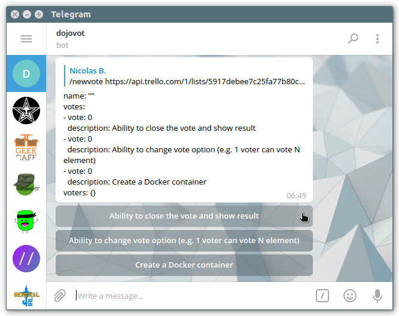
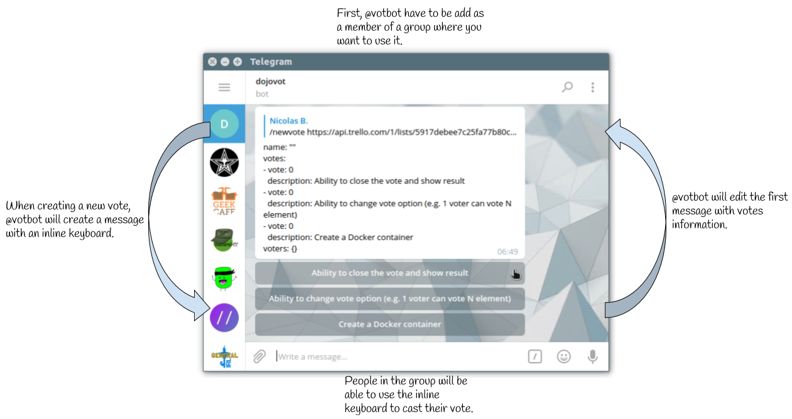

# VotBot
<p align="center">
  
</p>

VotBot is a Telegram bot to organize votes. It is special in two points:

  1. It can take a Trello Card List json URL in parameter ([see details](https://github.com/epfl-dojo/votbot/blob/master/README.md#how-to-use-the-bot-with-trello));
  1. It's stateless: all data are stored in the chat itself ([see operation chart](https://github.com/epfl-dojo/votbot/#operation-chart)).


## Run the bot
  * Use `make` to build votbot executable
  * Export your Telegram Bot Token before running the executable:  
    `export BOT_TOKEN=123456789:THISISATELEGRAMBOTTOKEN_@botfather; ./votbot`


## Usage
  * Talk to the bot ;
  * Create a new vote:  
    `/newvote https://raw.githubusercontent.com/epfl-dojo/votbot/master/minimal.json`
  * Do your vote ;
  * Close the vote:
    1. Reply the following to the vote message
    1. `/close`


## Minimal JSON
If you do not want to use a trello cards lists json url, you can use any json
file with, at least, these attributes:

```
{
    "name": "Name of the vote",
    "cards": [
        {
            "name": "First vote option"
        },
        {
            "name": "Second vote option"
        },
        {
            "name": "Third vote option"
        }
    ]
}
```

An example stands here: https://raw.githubusercontent.com/epfl-dojo/votbot/master/minimal.json


## Screenshot



## Operation Chart



## How to use the bot with Trello
  1. Open your Trello board
  1. Add `.json` to its URL
  1. Find the list ID you need (<kbd>ctrl</kbd>+<kbd>f</kbd>)
  1. Use [api.trello.com/1/lists/[idList]](https://developers.trello.com/advanced-reference/list#get-1-lists-idlist)
link
  1. Add this query string: `?fields=name&cards=open&card_fields=name,url`
  1. Talk to [@votbot](https://t.me/votbot) and use `/newvote URL`

### At epfl-dojo we use
  * https://api.trello.com/1/lists/58c1b0c5a2c599346fd571ac?fields=name&cards=open&card_fields=name,url (dojo avancés)
  * https://api.trello.com/1/lists/57fce1082db3216e660bcc67?fields=name&cards=open&card_fields=name,url (dojo apprentis)
