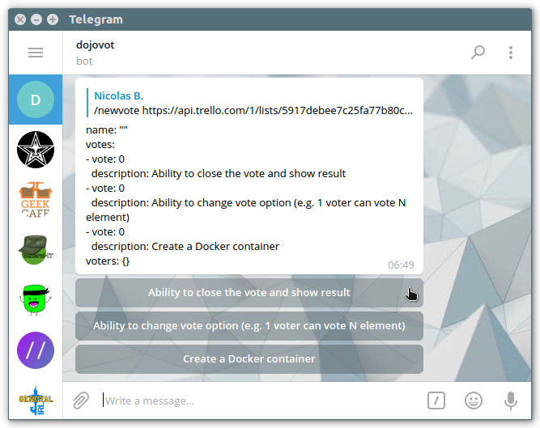
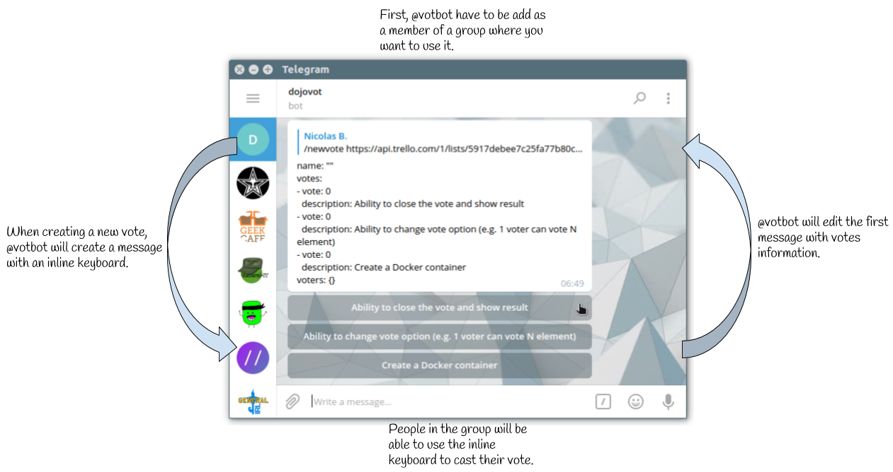

# VotBot
VotBot is a Telegram bot to organize votes. It is special in two points:
  1. It take a Trello Card List json url in parameter ;
  1. It's stateless: all data are stored in the chat itself.

## Run the bot
  * Use `make` to build votbot executable
  * Export your Telegram Bot Token before running the executable:  
    `export BOT_TOKEN=123456789:THISISATELEGRAMBOTTOKEN_@botfather; ./votbot`

## Usage
  * Talk to the bot ;
  * Create a new vote:  
    `/newvote https://api.trello.com/1/lists/5917debee7c25fa77b80cae1?fields=name&cards=open&card_fields=name,url`
  * Do your vote ;
  * Close the vote:
    1. Reply the following to the vote message
    1. `/close`

## Screenshot

## Operation Chart

